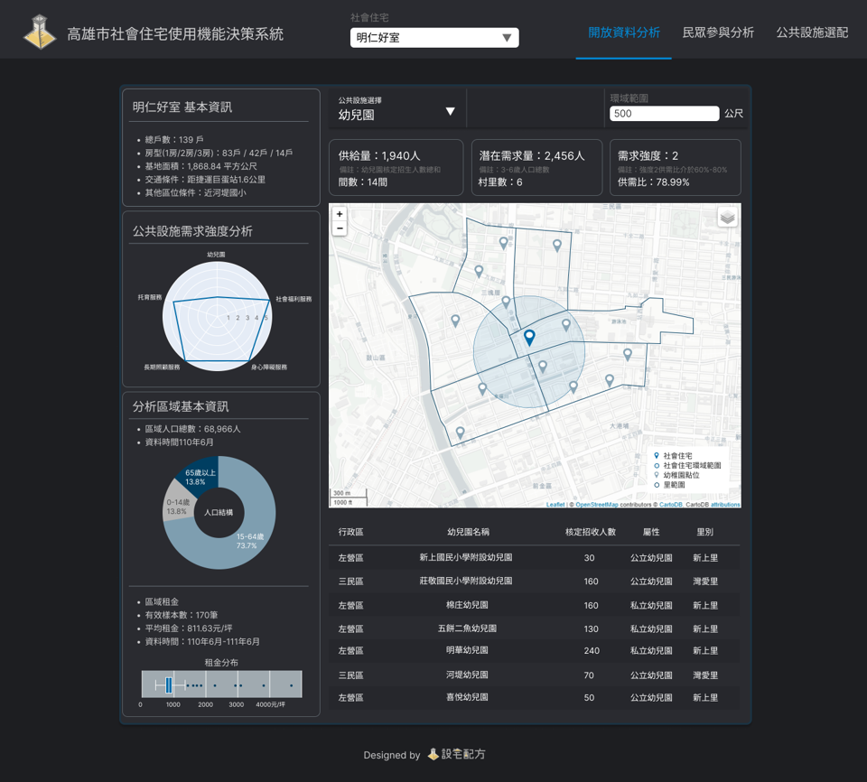

# 設宅配方-社會住宅使用機能智慧決策系統
**2022資料創新應用競賽-智宅社區新生活應用組 | 銀獎🥈**


----

- [專案簡介](#專案簡介)
- [專案簡介](#專案簡介)
- [專案簡介](#專案簡介)
- [專案簡介](#專案簡介)

## 專案簡介
「設宅配方」為促使社會住宅公共空間使用效率最大化，將設施需求程度列為評估指標， 如社宅附屬設施之托幼中心、長照中心，及周邊居民需求之青創空間、圖書室等。 社宅規劃單位可依照所蒐集到的社宅申請需求、當地居民需求回饋，換算權重後輸入數值， 系統將計算推薦最適的公共設施空間排列組合，快速輔佐社宅規劃人員進行決策。


## 網頁簡介

整個系統會分成三個頁面 
分別為 `社宅基本資訊與公益設施供需分析` 、 `民眾參與的表單彙整`、以及最後的 `公共設施需求程度結果`
我們在系統建置強調資料的即時更新與互動，以下是介面的介紹

### 頁面一

首先進入系統先選擇社宅 這邊以明仁好室為例 左側欄可以看到社宅的基本資訊以及區域的人口租金等資料
以便公益設施需求量的分析
那社宅所在區域預設值是以社宅buffer500公尺的里為範圍
右側可以點選不同的附屬設施 了解分布情形 尋求進駐的合作對象
以及計算後的分別的供需量與需求強度(B2)

### 頁面二
民眾參與分析連結彙整表單的意見
分為B1社區以及A1社宅居民個別對於高附著以及低附著設施的需求程度

### 頁面三
最後公共設施需求程度
高低附著力填分別填入變數的權重 
計算出各項的需求程度排序

最後在規劃低附著力設施空間參考E值的計算結果 得出最有效率的空間配置


## 專案結構
```
Rental_Prediction_TNN/
    ├─ app               // 存放建置網頁所需function
    |   ├─ ui/
    |   |   └─ ...
    |   ├─ helpers.py
    |   ├─ tab_map.py                
    |   ├─ tab_setting.py
    |   └─ ...    
    ├─ assets/           // 網頁Logo、圖標及排版
    |   ├─ css/
    |   ├─ js/
    |   ├─ img/
    |   └─ ...
    ├─ config /           // 常用設定
    |   ├─ constants.py
    |   ├─ strings.py
    |   └─ styles.py
    ├─ config /           // 常用設定
    |   ├─ constants.py
    |   ├─ strings.py
    |   └─ styles.py
    ├─ data/   
    |   ├─ index.html     // 互動式地圖
    |   └─ ...                
    ├─ scss/            
    ├─ main.py            // 主程式
    ├─ requirements.txt          
    ├─ Procfile
    ├─ images/        
    └─ README.md  
```


## 技術說明

以python的Dash框架為基礎設計互動式網頁。

## 貢獻者
- 黃軒柏
- 陳美靜
- 顧永平
- 張竣翔

## 其他
- [競賽簡報]()
