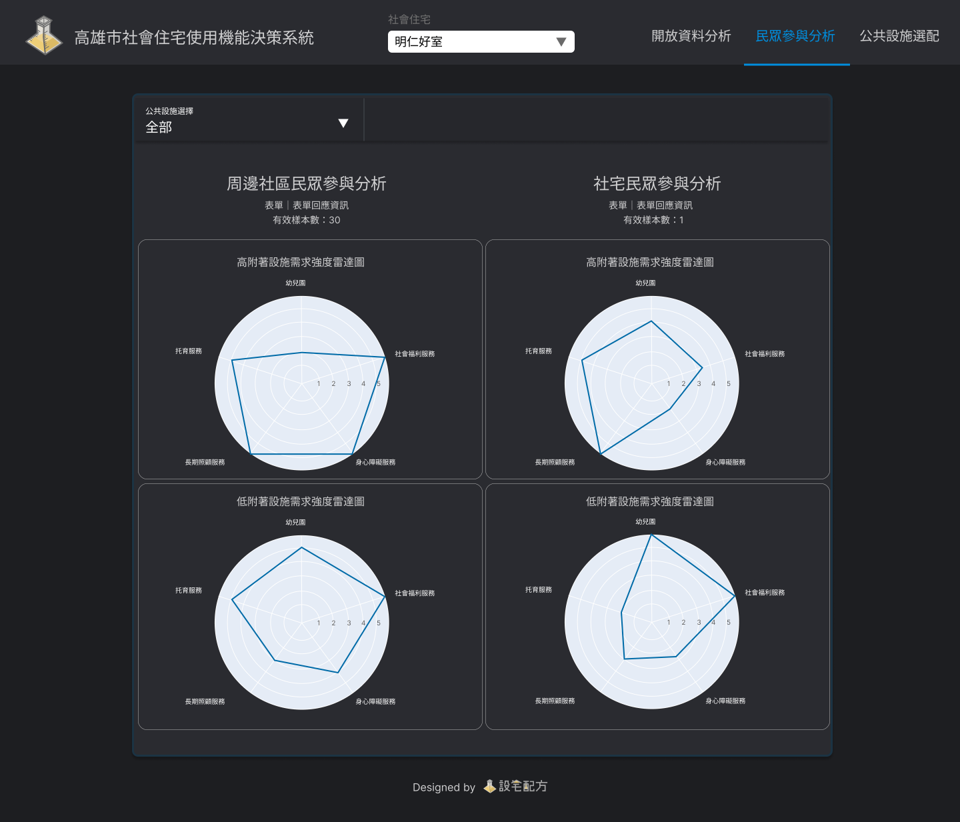

# 設宅配方-社會住宅使用機能智慧決策系統
**2022資料創新應用競賽-智宅社區新生活應用組 | 銀獎🥈**


----

- [專案簡介](#專案簡介)
- [系統架構](#系統架構)
- [技術說明](#技術說明)
- [專案結構](#專案結構)
- [貢獻者](#貢獻者)


## 專案簡介
「設宅配方」為促使社會住宅公共空間使用效率最大化，將設施需求程度列為評估指標， 如社宅附屬設施之托幼中心、長照中心，及周邊居民需求之青創空間、圖書室等。 社宅規劃單位可依照開放資料中的供需量統計數據及所蒐集到的社宅申請需求、當地居民需求回饋，換算權重後輸入數值， 系統將計算推薦最適的公共設施空間排列組合，快速輔佐社宅規劃人員進行決策。

- [競賽簡報](https://ncku365-my.sharepoint.com/:p:/g/personal/f24076182_ncku_edu_tw/ERvVH0DYjmNOjquvK7VOOcgBhR1ChUac2lKLfGbmZH6prA?e=gaR0rB)
- [網頁Demo影片](https://youtu.be/uyIxsxTlKL8)

## 系統架構

整個系統會分成三個頁面 
分別為 `開放資料分析(社宅基本資訊與公益設施供需分析)` 、 `民眾參與分析(民眾意見表單彙整)`、以及最後的 `公共設施選配(公共設施需求程度結果及建議)`，整個系統強調**結合科學專業數據及基層民意結果**，將兩者數據進行權重調配計算，最終計算出E值(詳細計算公式與原理詳見競賽簡報)，同時在系統網頁上也強調資料的互動性，以下為各頁面功能簡介：


### 頁面一 | 開放資料分析


此版面目的為有助於規劃人員快速彙整大量開放資料，並視覺化呈現以利決策進行。

分析儀錶板分為左右兩大部分：
- 左半部：為社會住宅基本資訊、公共設施需求強度分析及分析區域基本資訊等面板，其數據將依據所選之社宅不同而變動。
- 右半部：為針對該社會住宅周邊各項公共設施進行深度分析，包含供需量等，可自行設定公共設施種類與分析範圍。

使用步驟
- STEP1. 在最上方的置頂列中選取欲分析之社會住宅
- STEP2. 在公共設施選擇中選取欲分析之公共設施，包含各項住宅法所規範之附屬設施(例如托嬰、幼兒園、身心障礙服務等)。
- STEP3. 設定欲分析之環域範圍，預設為500M，可因應不同地點的基本條件不同而因地制宜的進行調整。
- STEP4. 系統將根據設定條件從後端資料庫中回傳相對應之分析結果。

----


### 頁面二 | 民眾參與分析


此版面目的為落實民眾參與分析，彙整表單內的各項民眾意見，並視覺化呈現。

分析儀錶板分為左右兩大部分：
- 左半部：係針對 `社宅周邊民眾` 之問卷內容進行分析，並將高附著與低附著設施進行區分。
- 右半部：係針對 `欲入住社宅民眾` 之問卷內容進行分析，並將高附著與低附著設施進行區分。

----
### 頁面三 | 公共設施選配


此版面的目的為整合上述兩頁面之資訊，並在開放資料統計數據與民眾參與兩者間設定合適之權重參數，進行最後的需求強度計算。

分析儀錶板分為上下兩部分：
- 上半部：`高附著力公共設施需求計算`，可根據地方特色進行參數權重調配計算，最終計算出高附著力公共設施需求排序。
- 下半部：`低附著力公共設施需求計算`，可根據地方特色進行參數權重調配計算，最終計算出低附著力公共設施需求排序，並根據我們所提之E值提出最有效率之公共設施空間配置建議。


## 技術說明

本網頁係以python的Dash框架為基礎所設計之互動式網頁儀錶板。
- 前端：plotly(互動式圖表)、Folium(互動式地圖)
- 後端：GeoPandas(進行Buffer運算及Intersection篩選)、Google APIs(及時串接民眾表單回應)
- 資料庫：PostgreSQL(接收GeoPandas計算出的交疊範圍並回傳相應之數據)
- 網頁部署：heroku


## 專案結構
```
Rental_Prediction_TNN/
    ├─ app               // 存放建置網頁所需function
    |   ├─ ui/
    |   |   └─ ...
    |   ├─ helpers.py
    |   ├─ tab_map.py                
    |   ├─ tab_setting.py
    |   └─ ...    
    ├─ assets/           // 網頁Logo、圖標及排版
    |   ├─ css/
    |   ├─ js/
    |   ├─ img/
    |   └─ ...
    ├─ config /           // 常用設定
    |   ├─ constants.py
    |   ├─ strings.py
    |   └─ styles.py
    ├─ config /           // 常用設定
    |   ├─ constants.py
    |   ├─ strings.py
    |   └─ styles.py
    ├─ data/   
    |   ├─ index.html     // 互動式地圖
    |   └─ ...                
    ├─ scss/            
    ├─ main.py            // 主程式
    ├─ requirements.txt          
    ├─ Procfile
    ├─ images/        
    └─ README.md  
```

## 貢獻者
- 黃軒柏
- 陳美靜
- 顧永平
- 張竣翔

